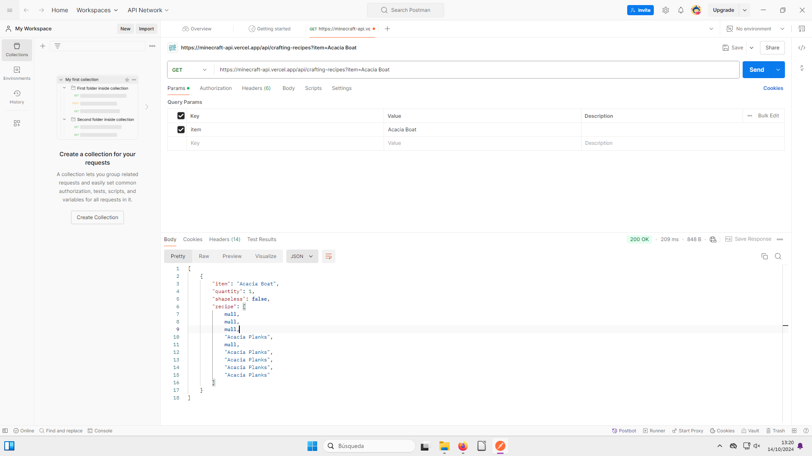
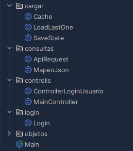
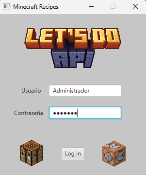
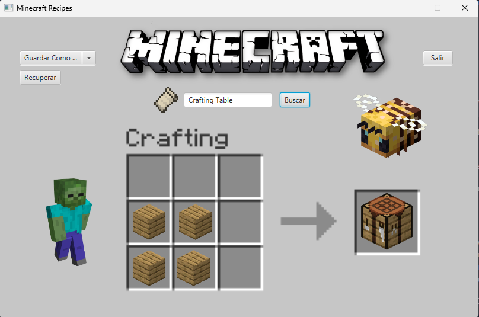
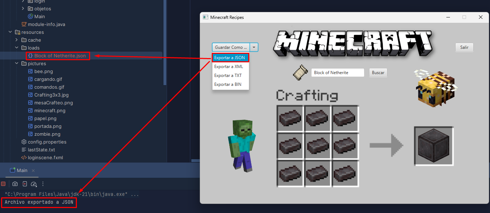
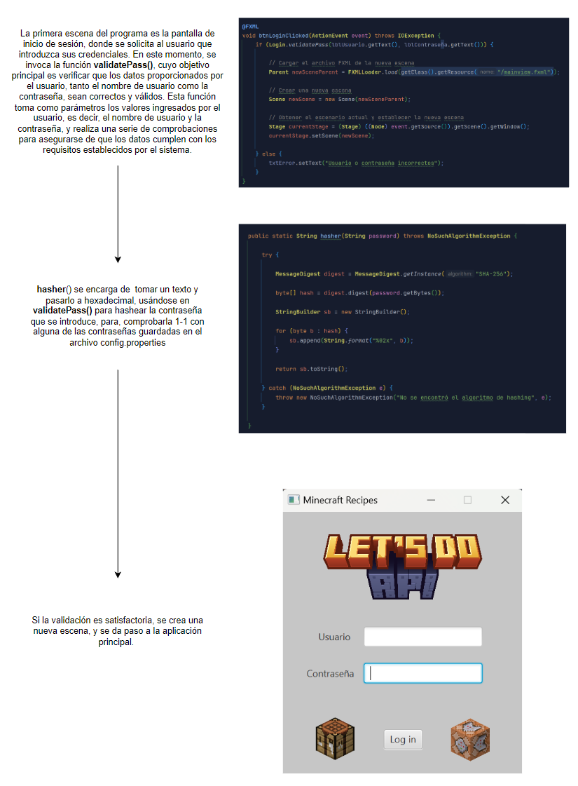
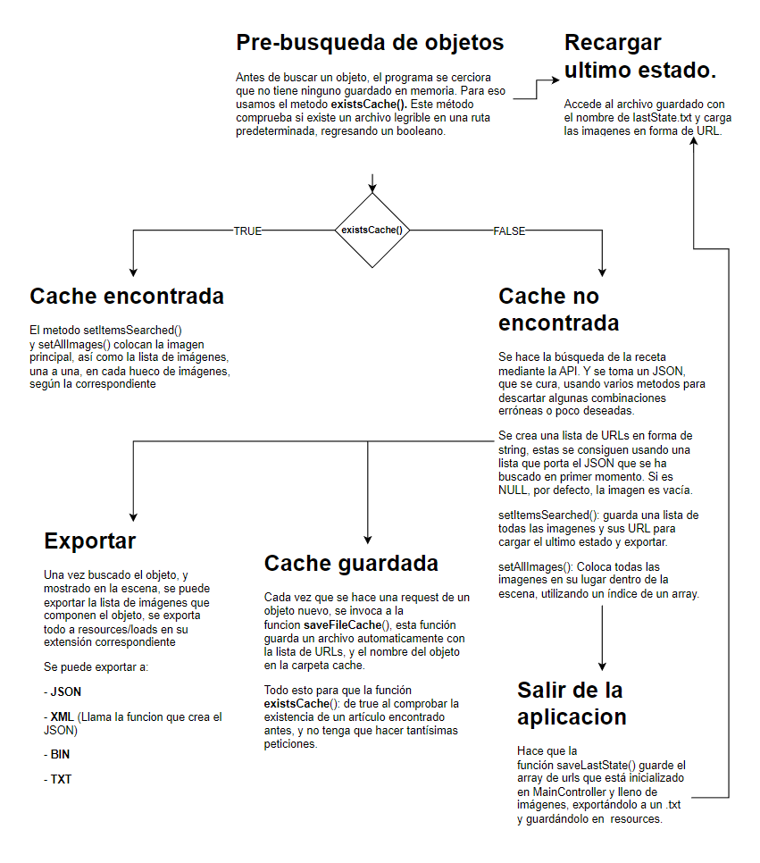
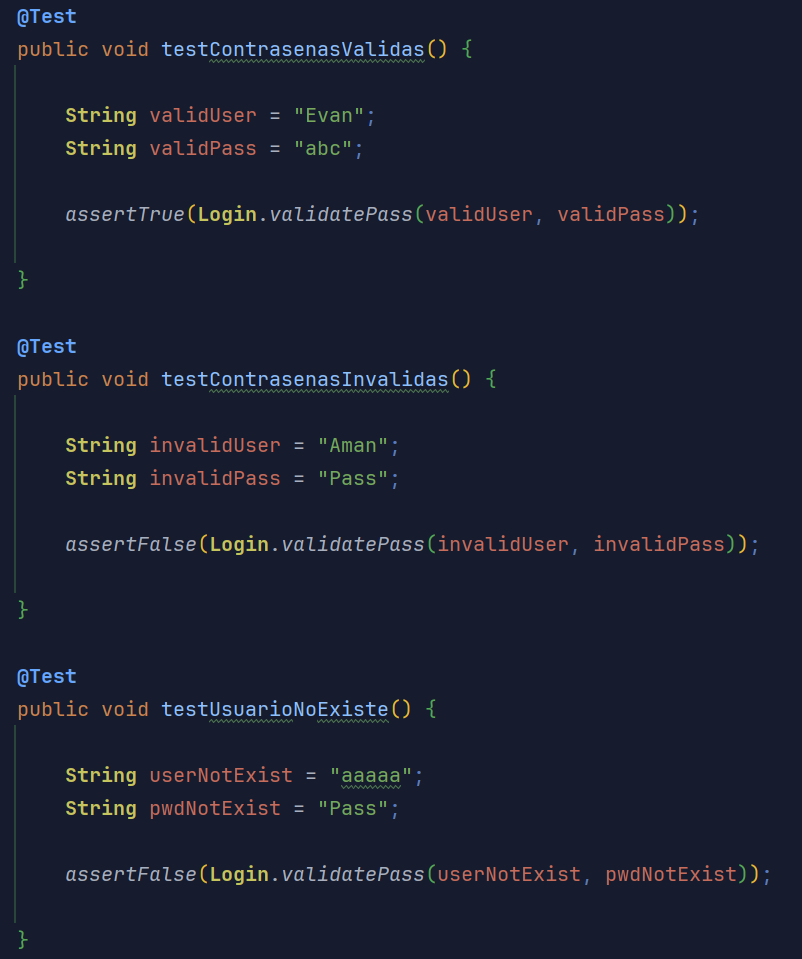

# Minecraft Recipes
#### Por Aman Vilariño y Evan Silva

Minecraft Recipes es un proyecto diseñado para ofrecer asistencia a la hora de encontrar recetas para diferentes bloques, herramientas y armaduras dentro del juego [Minecraft](https://www.minecraft.net/es-es). El proyecto está desarrollado de modo que sigue un diseño  centrado en hacer el código ampliable y extendible, fácil de manipular, cambiar o mejorar. Para esto, se ha usado un un algoritmo que hace peticiones a una [API externa](https://minecraft-api.vercel.app/api/) que provee archivos JSON con la información necesaria. 

Utilizamos un set-up de JavaFX que nos permite crear ventanas emergentes, asignarles botones y darle tamaño y estética a la aplicación.

Algunos ejemplos del JSON que recibimos de postman:



##### Las caracteristicas del proyecto son:
- Logearse en la aplicación usando usuarios que estén registrados.
- Mostrar una receta válida para crear un objeto mediante el sistema de creación que el juego Minecraft.
- Exportar la información del objeto buscado a diferentes formatos
- Recuperar el último estado, en caso de que este exista, y mostrar el objeto pertinente.
- Guardar una lista de objetos buscados para su uso off-line.

##### Como obtener el proyecto

Moverse y Crear una carpeta en el escritorio dónde guardar el proyecto, para que no esté directamente en el escritorio. Se requiere tener instalado [Git](https://git-scm.com) en el sistema
```
$cd Desktop
$mkdir proyectoMCRecipes
$cd proyectoMCRecipes
$git clone https://github.com/AmarinoLama/proyectoUD1_mcRecipes.git
```

Una vez descargado, podremos acceder al proyecto dentro del escritio, en la carpeta que hemos creado.

##### Arquitectura del proyecto
El proyecto se ha diseñado cinco paquetes diferentes, **cargar**, **consultas**, **controlls**, **login** y **objetos**.




###### Cargar
El paquete se centra en ordenar los métodos relacionados con la información que se guarda del proyecto, desde la exportación, hasta los métodos de guardado en diferentes formatos de archivo.

###### Consultas
Diseñado para manejar las consultas del programa, en estos paquetes se trabaja con peticiones http hacia la API, las cuales devuelven JSON en forma de String para poder ser trabajado, así como su mapeo hacia diferentes clases con las que trabajar para ordenar la información.

###### Controlls
Aquí se encuentran las clases unidas a las diferentes stages que utiliza JavaFX para enlazar eventos con la interacción del usuario en la interfaz gráfica.

###### Login
Este paquete tiene la lógica detrás del encriptado y log-in del usuario. Actualmente hay tres usuarios. Administrador, Aman y Evan. Para añadir nuevos usuarios, hay que usar el método creadorProperties(), y modificarlo para que añada un usuario con su contraseña.

###### Objetos
Por último, en este paquete es se encuentran las clases que crearán objetos tipo Item y Recipe. 

##### Como usar el proyecto 
Necesitamos [InteliJ](https://www.jetbrains.com/idea/) y [JavaFx](https://gluonhq.com/products/javafx/) para poder hacer funcionar el proyecto:

Añadimos esta línea a en el apartado de ejecutar programa de intelij [RUTA] es donde se encuentra tú javafx instalado

```--module-path="[RUTA]javafx-sdk-21.0.5\lib" --add-modules="javafx.base,javafx.controls,javafx.fxml,javafx.graphics,javafx.swing,javafx.media"
Usamos el siguiente comando en el CMD
`java --module-path="C:\Program Files (x86)\javafx-sdk-23.0.1\lib" --add-modules="javafx.base,javafx.controls,javafx.fxml,javafx.graphics,javafx.swing,javafx.media" -jar .\out\artifacts\proyectoUD1_mcRecipes_jar\proyectoUD1_mcRecipes.jar 

```
Nos logueamos usando un usuario y contraseña predefinidos:
Administrador - renaido



Buscamos un bloque, herramienta o armadura en específico:



Y podemos exportar el bloque a cualquier formato de estos cuatro:



## Flowchart de la aplicación




##### Reparto de tareas

El proyecto se ha desarrollado en su mayoria utilizando el modo de trabajo "Pair Programming", dónde solo hay un teclado para escribir, y hay un piloto y copiloto, el piloto programa, y el copiloto consulta documentación y código. Aún así, hay partes que se han desarrollado por su cuenta, pero siguiendo un estlo escalable y modificable, haciendo que el código sea mantenible a futuro. 

Aman se ha encargado del paquete cargar y todos sus métodos.
Evan se ha encargado del paquete Login y todos su métodos. 

Ambos han contribuido a la arquitectura de la aplicación, Aman apoyándose en una soltura mayor a la hora de picar la mayor parte del código código mas tedioso, y Evan a la hora de diseñar el flow de la aplicación, para que sea escalable y modificable, reutilizando código, así como la creación del readme.md.

##### Extras realizados:

- *Ordenación de resultados de las consultas y almacenaje de los datos*

 Se puede ver como en la aplicación ordena y muestra una serie de bloques, además, internamente, se hacen requests a varias partes de la misma API, pero que ofrece diferentes JSON. 
- *Control de errores*


El programa goza de casos test realizados, entre otras, para que el login funcione.



Flow de la aplicación


- *Uso de la aplicación offline*
- *Almacenamiento del último estado de ejecución de la aplicación*

La aplicación tiene integrado el paquete **Cargar**, que permite guardar el ultimo estado, así como guardar las consultas ya hechas, haciendo que funcione de manera offline con busquedas ya hechas.

- *Al iniciar la aplicación se preguntará al usuario si quiere recuperar la última consulta y esta se recuperará offline.*

Se ha diseñado para que una vez loggeado, puedas seleccionar la opción para recargar el último estado.
- *Adición de un login (control de acceso restringido) con usuario y contraseña contenidos en un fichero de Properties y encriptación*

Con el uso del paquete Login, y un stage pre-aplicación, el usuario puede loguearse si está en una whitelist creada con un archivo .properties

##### Propuestas de mejora:

- Hacer que a la hora de exportar el archivo se mueva a descargas.
- Añadir un método para registrar usuarios y guardarlos.
- Crear un .exe para que sea ejecutable en cualquier momento.
- Arreglar getCorrectCraft()

##### Conclusiones y opinión del trabajo realizado. Incluid dedicación temporal y cualificación estimada.

Ha sido un proyecto dónde el cuerpo principal ha sido mucho más sencillo que los extras, y la mayor parte del problema ha sido a la hora de lidiar en como utilizar la información. 

Al tener que hacer varias request a diferentes partes de la misma API, el punto central ha sido el usar la información de la rama [RECIPES] y conseguir las imagenes de cada objeto, que se encontraba dentro de la rama [ITEMS] y [BLOCKS], por lo que mezclar tres busquedas de API en una ha sido un problema a tener en cuenta, y que añade una carga de tiempo a la hora de manejar las request a la API, haciendo que se tarde bastante tiempo en conseguir una respuesta y el código se ejecute. 